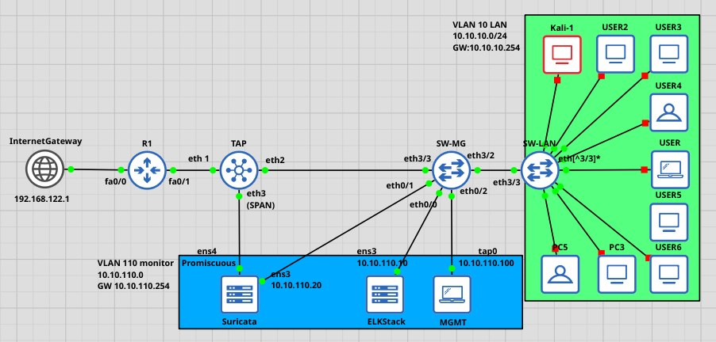
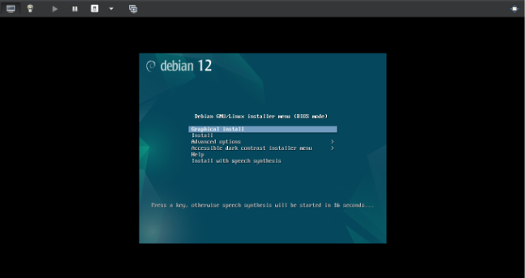
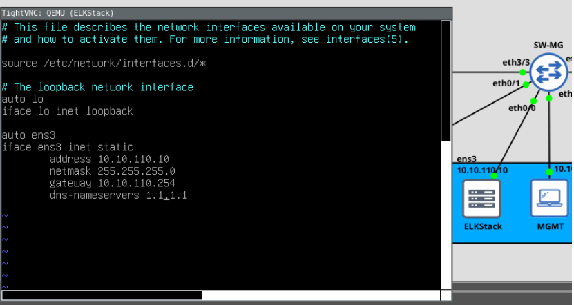
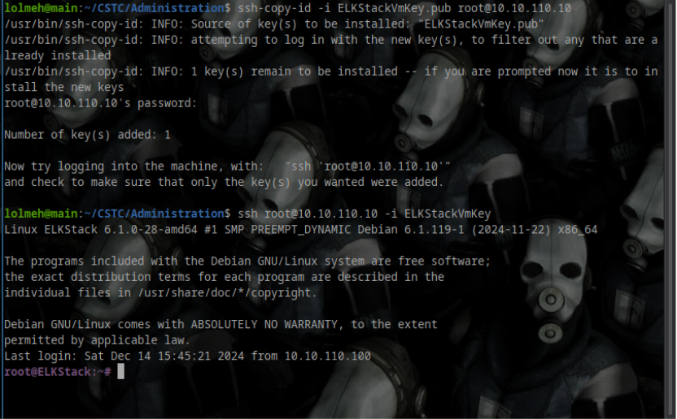
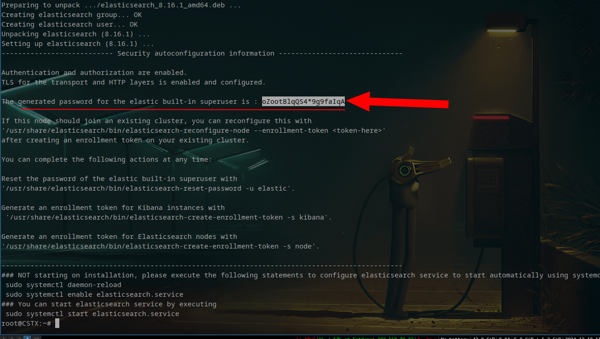
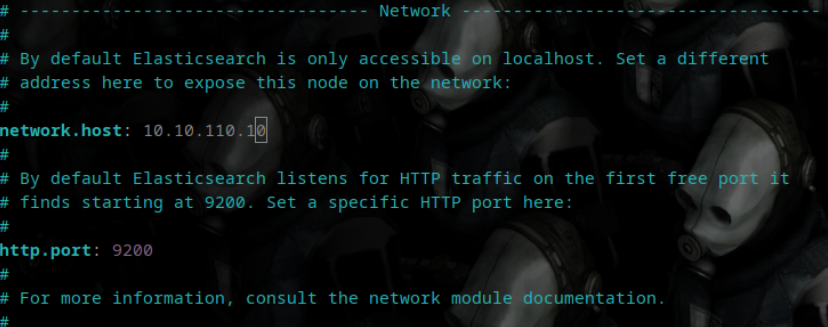
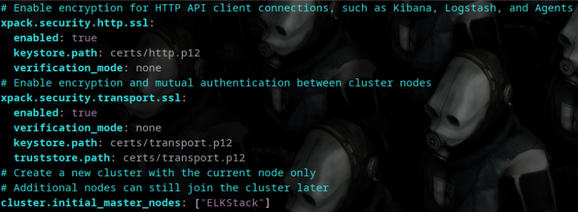
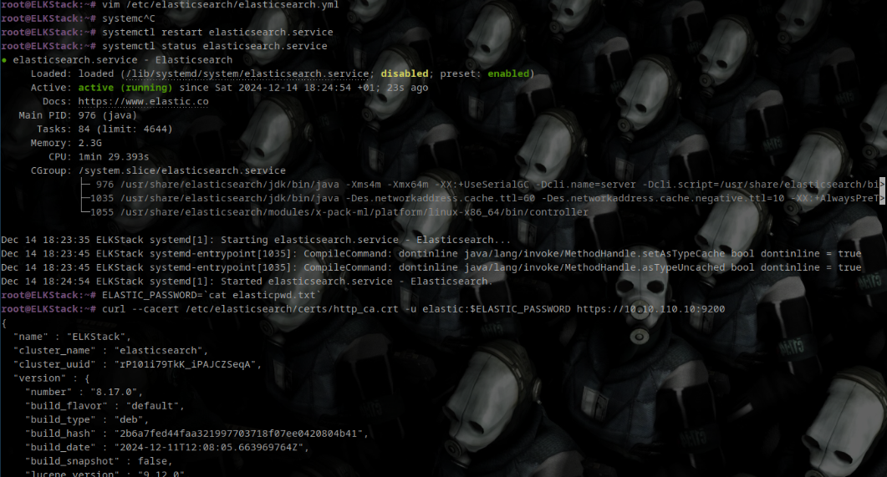
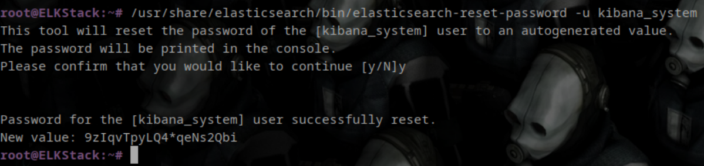
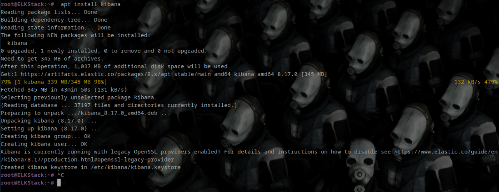

 ##### by [Abderrahim CHABIR](https://www.linkedin.com/in/abderrahim-chabir-61442a276/) 


### **Table of Contents**

1. **[Introduction](#introduction)**
2. **[Topology](#topology)**
    - [Network Layout](#network-layout)
    - [Machine Roles](#machine-roles)
3. **[ELK Stack Setup](#elk-stack-setup)**
    - [Why Use Elasticsearch and Kibana?](#why-use-elasticsearch-and-kibana)
    - [Machine Setup](#machine-setup)
    - [Installation](#elkstack-installation)
    - [Configuration](#elkstack-configuration)
    - [Kibana Setup](#kibana-installation-and-configuration)
4. **[Suricata IDS Setup](#suricata-setup)**
    - [Why Suricata?](#why-suricata)
    - [Machine Setup](#suricata-machine-setup)
    - [Installation](#suricata-installation)
    - [Configuration](#suricata-configuration)
    - [Testing Suricata](#testing-suricata)
5. **[Integrating Suricata with ELK](#integrating-suricata-with-elk)**
    - [Overview](#brief-explanation)
    - [Installing Beats](#installing-the-beats)
    - [Configuring Filebeat](#filebeat-configuration)
    - [Configuring Auditbeat](#auditbeat-configuration)
    - [Verifying Logs in Kibana](#visualizing-logs-in-kibana)
6. **[Attack Simulations](#attack-simulations)**
    - [Kali Machine Detection](#kali-machine-detection)
    - [Nmap Scan](#nmap-scan)
    - [SYN Flood](#syn-flood)
    - [Tor Traffic](#tor-traffic)
7. **[Conclusion](#Conclusion)**

---
### Introduction:

In this lab, i  will walk through the setup and configuration of **Suricata** as an **Intrusion Detection System (IDS)**, integrated with an **Elastic Stack (Elasticsearch & Kibana)** to create a complete solution for detecting and visualizing network anomalies.
Our goal is to build an environment capable of **collecting, analyzing, and visualizing network traffic logs** efficiently. To simulate the network topology, i will use **GNS3**, providing a flexible and realistic testbed.
Additionally, i  will **simulate a few attacks** to validate the detection and visualization capabilities of our setup.

### Topology:



#### Legend :
##### Networks:

| VLAN |     Range      |    Gateway    |   Name    |
| :--: | :------------: | :-----------: | :-------: |
|  10  | 10.10.10.0/24  | 10.10.10.254  |    LAN    |
| 110  | 10.10.110.0/24 | 10.10.110.254 | `MONITOR` |

##### Machines:

| Name     | OS              | Tools and services                                   | Role Description                                                                                                                                                                      |
| -------- | --------------- | ---------------------------------------------------- | ------------------------------------------------------------------------------------------------------------------------------------------------------------------------------------- |
| ELKStack | Debian 12       | - Elasticsearch<br>- Kibana<br>- openss              | Elasticsearch and Kibana allow you to<br>collect, analyze and visualize data from<br>real-time logs. It centralizes the generated logs by Suricata and other tools for analysis       |
| Suricata | Debian 12       | - Suricata<br>- filebeat<br>- auditbeat<br>- openssh | an intrusion detection system (IDS) for<br>monitor and analyze network traffic in real time, It generates logs which are sent to<br>Filebeat to be indexed and viewed via<br>ELKStack |
| MGMT     | Debian 12       | - openssh                                            | My host machine integrated into this LAB to facilitate configuration and management via ssh                                                                                           |
| USERS    | Windows / Linux |                                                      | User machines connected to the LAN                                                                                                                                                    |
| Kali     | Have a guess    | - nmap, hping etc...                                 | We will use this machine to simulate attacks                                                                                                                                          |


### Set up:
#### ELKStack

##### Why use Elasticsearch and kibana ? 


Elastic stack is a software suite used for **collecting, processing, storing, and visualizing data**, often in the context of log management and monitoring. Its name comes from the initials of its three main components:
	 **Elasticsearch**: A NoSQL database based, designed for fast indexing and searching of large amounts of data. It is ideal for analyzing structured or semi-structured data.
	 **Logstash**: A data processing pipeline that collects data from various sources, transforms it as needed (e.g., filtering or enriching logs), and then sends it to a destination, typically Elasticsearch.
     **Kibana**: A user interface that allows interaction with data stored in Elasticsearch. It provides dynamic dashboards and visualization tools to help understand the data.
    **Beats**: a family of lightweight, open-source data shippers that are part of the **Elastic Stack (ELK Stack)**. Beats are designed to send data from various sources to **Logstash** or directly to **Elasticsearch**. They are used to collect and transmit specific types of data, such as metrics, logs, or events, from distributed systems and applications.
to keep things simple i will  be using filebeat instead of logstash to collect and parse  suricata logs and send them our elasticsearch database for indexing.

###### machine setup:

we first spin up  a debian virtual machine 



then we need to configure the network settings to allow the
machine to connect to the network and the Internet, we will set the ens3 to 10.10.110.20 by modifying the /etc/network/interfaces file



we then connect to our ELKStack machine via ssh



###### ELKstack installation

The first thing we need to do in order to actually install Elasticsearch on our machine, as per the Elastic.io documentation, is to install gpg  and add the Elastic public signing key to our keyring

```
sudo apt update
sudo apt install -y gnupg
wget -qO - https://artifacts.elastic.co/GPG-KEY-elasticsearch | sudo gpg --dearmor -o /usr/share/keyrings/elasticsearch-keyring.gpg
```

then adding the elastic repo and installing it with apt 

```
sudo apt-get install apt-transport-https

echo "deb [signed-by=/usr/share/keyrings/elasticsearch-keyring.gpg] https://artifacts.elastic.co/packages/8.x/apt stable main" | sudo tee /etc/apt/sources.list.d/elastic-8.x.list

sudo apt-get update && sudo apt-get install elasticsearch
```

after the installation is done you will notice that a default password was generated, save it 




###### ELKstack configuration

now that it has been successfully installed you we can move on to configuring it 

we modify `/etc/elasticsearch/elasticsearch.yml` to set up our own server IP address



for simplicity we will be disabling the ssl verification mode for this lab  therefore `verification_mode` should be set to `none`




we save the configuration and start the service, then check if everything is running smoothly



everything is running as intended, now we need to generate a token for the kibana_system user 



###### Kibana installation

since we already added the elastic signing key all we have to do now is run `sudo apt install kibana` and it will be installed




###### Kibana configuration

we generate the xpack.security seencryption keys that will be used to store the
session data in Kibana and add it to the Kibana configuration file located in
`/etc/kibana/kibana.yml`,  we use the the command `kibana-encryption-keys` for this

![[12-kiban-conf.png]]

we then modify the same file to specify our Kibana service IP and port then our Elasticsearch server IP and credentials

![[13-kibana-conf.png]]

![[kibana-conf2.png]]

we make sure ssl verification is set to none

![[14-ssl-none.png]]

again after saving the modifications we restart the service to check if everthing is running

![[15-kibana-running.png]]

we then open the kibana web interface at https://10.10.110.10:5601  and we login as elastic with the password that was first generated when we installed elasticsearch

![[19-kibana-interface.png]]

using the elastic user is probably not the best idea, so we need to go to the main menu, then  head to the stack management > users to create a new 
administrator user that we will use to connect to kibana with the following roles:
`kibana_system, kibana_admin, monitoring_user, editor`

![[20-adding-adming-user.png]]

now that everything is set we enable kibana and elasticsearch to start on boot 

```
sudo systemctl enable elasticsearch.service
sudo systemctl enable kibana.service
```


#### Suricata

##### Why Suricata:

![[x-suricata.png]]

Suricata is a high-performance  open source network analysis and threat detection tool
used by most private and public organizations and integrated by major organisations to protect their assets, It is mainly used for IT security, in particular to detect and preventnetwork intrusions. Suricata can inspect
real-time network traffic, capture packets, detect malicious signatures, and provide
detailed information on the protocols used.
In our case we will use it as an IDS (Intrusion Detection System), which means
that it will analyze network traffic passively and  generate alerts in case of suspicious activities and transmit them to our Elastic stack for analysis and visualization

##### Machine setup:

we will ben using a debian linux machine again with this network configuration 

![[22-sutricata-net-setup.png]]

ens3 is configured to be used to communicate with the network
ens4 is configured in promiscuous mode to listen for incoming packets

##### Suricata installation:

on debian we simply run `sudo apt install suricata` and it will be installed

![[23-apt-install-suricata.png]]

##### Suricata configuration:

we modify the `/etc/suricata/suricata.yaml` and set the **HOME_NET** variable to our target networks

![[20-suricata-home-net.png]]

then we modify the network interface label to our own interface in my case its `ens4`
![[24-ens4-1.png]]
![[25-ens4-2.png]]
![[26-ens4-3.png]]

then activate community-id

![[27-coom-id.png]]

Finally, we need to add this to the end of the config file to allow us to modify,
add and remove suricata rules without reloading it

![[28-rule-engine.png]]

An important thing to consider is that Suricata version 6 and earlier uses`/var/lib/suricata/rules` as rules file instead of `/etc/suricata/rules` we are using version 6, so we need to configure it

![[21-deb-ver-6-suricata.png]]

as always we save the file and restart the service

![[29-suriata-status-check.png]]

we update suricata by running `suricata-update`

![[30-suricata-update.png]]

we use the following command to update the list of suricata rule providers and list them with
```
suricata-update --no-check-certificate update-sources
suricata-update list-sources
```

![[31-suricata-list-sources.png]]

the ones under free licenses can be used without payment however we will have to pay to
use the ones under commercial license, dans notre laboratoire, nous utiliserons et/open et aleksibovellan/nmap

![[33-rules.png]]

we validate the config file 

![[35-ok.png]]

To test if suricata is correctly monitoring the network, we download a suspicious file from
http://testmynids.org/uid/index.html then we configure an http server to transmit this file
in without encryption to one of our machines on the LAN,  we notice that suricata detected this file and logged the incident in /var/log/suricata/fast.log

![[37-tinycore-wgetevil.png]]

![[38-log-test.png]]


#### Integrating suricata and elasticsearch

#####  Brief explanation :
Now it's time to make Suricata and ELK Stack work together. We can do this by
taking the contents of `/var/log/suricata/fast.log` and converting it into a format readable by Elasticsearch. We can achieve this by using tools like Filebeat to ingest and process the Suricata logs, then send them to Elasticsearch for indexing and analysis, and Auditbeat for authentication logs, we will refer to  these log analysis tools "beats"
##### Installing the beats

we will simply add the elastic repository to our source list and  install the beats with
apt

```
wget -qO - https://artifacts.elastic.co/GPG-KEY-elasticsearch | sudo apt-key add -

sudo apt-get install apt-transport-https

echo "deb https://artifacts.elastic.co/packages/8.x/apt stable main" | sudo tee -a /etc/apt/sources.list.d/elastic-8.x.list

sudo apt-get update && sudo apt-get install filebeat auditbeat
```

##### filebeat configuration

we  need to edit `/etc/filebeat/filebeat.yml` and set the Kibana host to our Kibana service address and the Elastisticsearch output to our elasticseach service address 
We also need to  make sure that https without certificate verification is enable on

![[39-kibana.png]]

![[40filebeat-elasticsearch.png]]

we need to head to the filebeat modules section and manually import the suricata module

![[41-manual-suricata-mdoule-import.png]]

we save the configuration file and run this command to force  import the suriacta module

![[42-force-run.png]]

Next, we will run the filebeat configuration command. The command configures
the initial environment, including the index model and Kibana dashboards

![[61-fibeatsetup.png]]
##### auditbeat Configuration

just like Filebeat, we will modify `/etc/auditbeat/auditbeat.yml` and configure the
information from Kibana and Elasticsearch

![[62-auditbeatconfig.png]]


#### Visualizing logs in Kibana

we log in to Kibana using our new administrator account

![[63-loggin-in.png]]


in the search box we look for suricata filebeat

![[63-loggin-in.png]]

we can see the events dashboard which lists all the  network events

![[65-event-dashboard-kibana.png]]

we also have the alerts dashboard which shows the alerts logged by suricata, we
see the alerts that we generated earlier are present 

![[66-suriicata-alerts.png]]

there is also an Auditbeat dashboard in the security section of kibana which visualizes the
access and authentication logs

### Attack simulations

In this section we will demonstrate some attacks and see if Suricata will log them, nothing crazy just some basic attacks to test suricata functionality .

one thing to note here  is that the ET (emerging threats) ruleset that we used has logged the existence of a kali machine in our network

![[71-kali-update-log.png]]

![[71-kali-update-dash.png]]

##### nmap scan

suricata detected the nmap scan because we used the nmap ruleset

![[70-nmap-test.png]]

![[70-nmap-test-dashboard.png]]

##### SYN flood

![[71-kali-update-log.png]]

![[72-synflood-dash.png]]

##### Tor traffic 

suricata also detects and logs tor traffic or any attempt to access with tor public nodes

![[90-tor-trafic.png]]
![[90-tor-trafic-dashboard.png]]

### **Conclusion**

At this stage, **Suricata** is fully configured as a **Host Intrusion Detection System (IDS)**. We have verified that network logs are being generated and processed correctly by **Suricata**. Additionally, we have integrated these logs into the **Elastic SIEM stack**, enabling their **visualization, indexing, and correlation** through **Elasticsearch and Kibana**.
